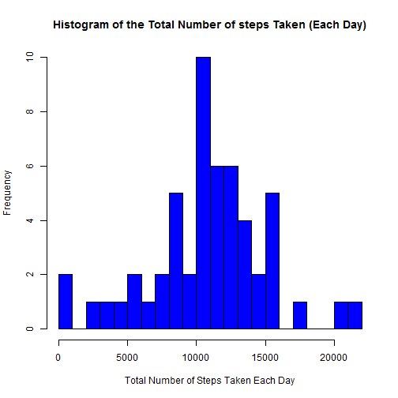
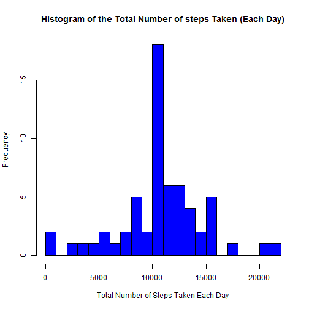
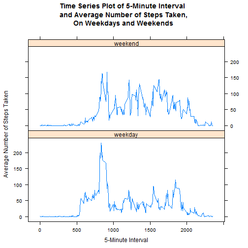

# Reproducible Research: Peer Assessment 1


## Loading and preprocessing the data

```r
Data <- read.csv(unz("activity.zip", "activity.csv"))
```
## What is mean total number of steps taken per day?

### Histogram of the total number of steps taken each day

```r
All_Steps <- as.numeric(tapply(Data$steps, Data$date, FUN=sum))
hist(
        All_Steps,
        col = "blue",
        main = "Histogram of the Total Number of steps Taken (Each Day)",
        xlab = "Total Number of Steps Taken Each Day",
        breaks = 20
)
```

 

### Mean and Median of the total number of steps taken each day

```r
mean(All_Steps, na.rm=TRUE)
```

```
## [1] 10766
```

```r
median(All_Steps, na.rm=TRUE)
```

```
## [1] 10765
```

## What is the average daily activity pattern?
### Time series plot of the 5-minute interval (x-axis) and the average number of steps taken 
### averaged across all days (y-axis)

```r
library(ggplot2)
averages <- aggregate(x=list(steps=Data$steps), by=list(interval=Data$interval), 
                      FUN=mean, na.rm=TRUE) 
ggplot(data=averages, aes(x=interval, y=steps)) + 
        geom_line() + 
        xlab("5-minute interval") + 
        ylab("average number of steps taken")
```

 
### Interval with Maxiumum number of steps 


```r
averages[which.max(averages$steps),"interval" ]
```

```
## [1] 835
```

## Inputing missing values

### Total number of missing values in dataset

```r
dim(Data[is.na(Data$steps), ])[1]
```

```
## [1] 2304
```
The strategy for filling in all of the missing values in the dataset is to change the "NA"s to the mean values for that 5-minute interval.

### Fill missing Values 

```r
NewData <- Data
NewData$steps <- sapply(seq_len(17568),function(i) 
   {if(is.na(NewData[i,'steps']))
         {averages[which(!is.na(match(averages[, 'interval'],NewData[i,'interval']))), 'steps']} 
    else 
         NewData[i,'steps']})
```
### histogram of the total number of steps taken each day with filled in Data Set

```r
New_All_Steps <- as.numeric(tapply(NewData$steps, NewData$date, FUN=sum))
hist(
        New_All_Steps,
        col = "blue",
        main = "Histogram of the Total Number of steps Taken (Each Day)",
        xlab = "Total Number of Steps Taken Each Day",
        breaks = 20
)
```

 
### Mean and Median of the total number of steps taken each day for filled in Data Set

```r
mean(New_All_Steps, na.rm=TRUE)
```

```
## [1] 10766
```

```r
median(New_All_Steps, na.rm=TRUE)
```

```
## [1] 10766
```
The new mean and median of total number of steps taken per day are 10766 and 10766 respectively, the median is exactly equal to the mean. Because of the strategy chosen, there is no impact of imputing missing data on the estimates of the total daily number of steps.

## Are there differences in activity patterns between weekdays and weekends?

### Find the Day of the Week using filled in Data Set.

```r
DayofWeek <- function(date) {
    day <- weekdays(date)
    if (day %in% c("Monday", "Tuesday", "Wednesday", "Thursday", "Friday"))
        return("weekday")
    else if (day %in% c("Saturday", "Sunday"))
        return("weekend")
    else
        stop("invalid date")
}
NewData$date <- as.Date(NewData$date)
NewData$day <- sapply(NewData$date, FUN=DayofWeek)
```

### Make a panel plot containing plots of average number of steps taken on Weekdays & Weekends.


```r
library(lattice)
averages <- aggregate(steps ~ interval + day, data= NewData, mean)
xyplot(steps ~ interval | day, averages,
       type = "l", 
       layout = c(1, 2), 
       main = "Time Series Plot of 5-Minute Interval \nand Average Number of Steps Taken,\nOn Weekdays and Weekends",
       xlab = "5-Minute Interval",
       ylab = "Average Number of Steps Taken")
```

 
